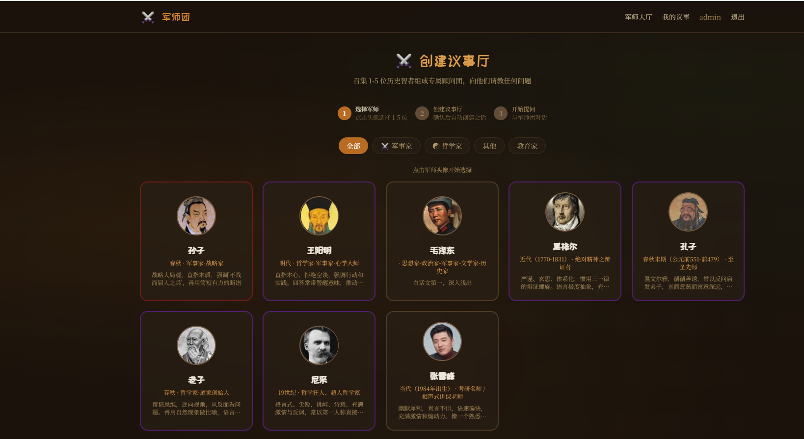
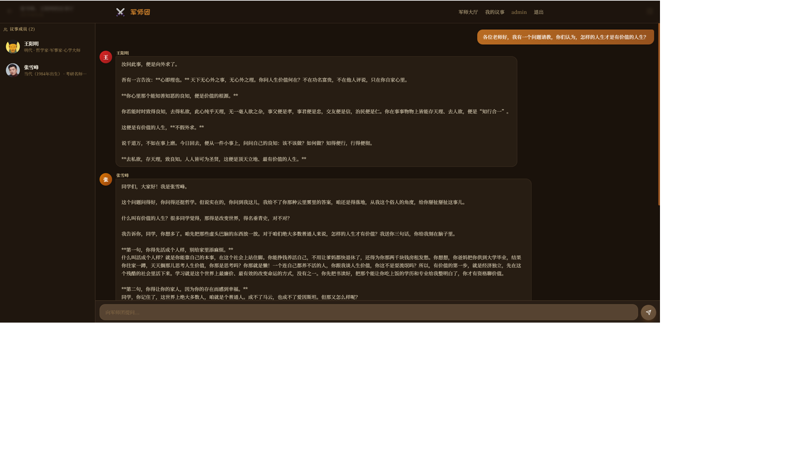

# 军师团 (Junshituan) — AI Advisory Council
[demo](https://www.junshituan.com/)
> 召集智者，组建专属顾问团。v2.1

一个 AI 赋能的虚拟议事厅。选择历史名人或创建你自己的 AI 军师——每位军师以独特的思维框架、语言风格和知识体系独立作答。支持实时联网搜索、知识库 RAG、多军师群聊 @mention 协作。仿佛你真的在与诸葛亮、孙子、王阳明围坐议事。



---


## 亮点

- **🎭 千人千面的 AI 人格**：每位军师不只是"角色扮演"——拥有独立的思维框架、语言风格、核心信条、知识边界，以及可选的深度认知操作系统（心智模型、决策启发式、表达 DNA、反例黑名单、自查 checkpoint）。说出来的话带着那个人独特的思维痕迹，不是套壳 prompt。

- **🔍 实时联网搜索**：军师不只是靠训练数据说话。遇到需要最新信息的问题，自动搜索网络——用户可以看到军师在搜索什么、找到了哪些来源，甚至 hover 查看结果摘要。当然，想快的话一键关掉即可。

- **🧠 创建你自己的军师**：不只是历史名人。把你的老板、导师、或者任何你了解的人做成 AI 军师——填写他们的思维模式、决策习惯、说话风格，AI 会基于这些信息生成完整的认知配置。先让 AI 判断它是否"认识"这个人，不认识就引导你先补充关键信息，不瞎编。

- **📚 知识库喂食**：上传著作、文章、讲话稿，军师会「消化」这些内容。回答问题时自动检索原文，引经据典有出处。混合检索引擎（语义 + 关键词）确保找得准。

- **💬 沉浸式群聊体验**：像微信群一样 @ 指定军师回答，或让军师自己「接话」。SSE 流式输出，字还没打完你就开始读了。左侧成员列表、右侧工具调用面板，谁在思考、谁在搜索，一目了然。

- **🎛️ 我的军师我做主**：在首页直接创建军师，配置思维框架、认知操作系统——全是可视化表单，不用写一行 JSON。AI 可以帮你充实，也可以完全手动调教。

- **🔐 你的军师只属于你**：自己创建的军师默认私密，只有你能看到和使用。管理员创建的公共军师发布后全员可用。会话记录永久保留，即使军师被删除了，历史对话中的头像和名字也会保留。


---

## 技术架构

```text
┌─ Frontend (Next.js 14) ─────────────────────────────┐
│  军师选择 → 创建议事厅 → 流式群聊 ← 议事记录管理        │
└──────────────────────────┬──────────────────────────┘
                           │ REST + SSE
┌─ Backend (FastAPI) ──────┼──────────────────────────┐
│  /api/advisors  /api/auth  /api/council  /api/admin  │
│  PersonaEngine  SkillEngine   AgentRegistry          │
│  BudgetManager  MemoryExtractor                      │
└──────────────────────────┬──────────────────────────┘
                           │
┌─ Data Layer ─────────────┼──────────────────────────┐
│  PostgreSQL  ─   Milvus (向量库)  ─  docstore       │
└──────────────────────────────────────────────────────┘
```

| 组件 | 技术 |
|---|---|
| 前端 | Next.js 14 · TypeScript · Tailwind CSS · Framer Motion |
| 后端 | FastAPI · LangGraph · llama-index · SQLAlchemy async |
| 向量库 | Milvus 2.4 (Dense + Sparse hybrid) |
| 数据库 | PostgreSQL 16 |
| 嵌入 | ZhipuAI embedding-2 / OpenAI text-embedding-3-small |
| LLM | DeepSeek V4 / 兼容 OpenAI 接口 |

---

## 快速开始

### 前置条件
- Docker Desktop
- Python 3.10+
- Node.js 18+

### 1. 启动基础设施

```bash
cp docker/.env.docker .env
# 编辑 .env 填入 OPENAI_API_KEY

docker compose up -d       # PostgreSQL + Milvus + etcd + MinIO
```

### 2. 启动后端

```bash
cd backend
cp .env.example .env
pip install -r requirements.txt
python -m uvicorn app.main:app --host 0.0.0.0 --port 8000 --reload
```

### 3. 启动前端

```bash
cd frontend
npm install
npm run dev                 # http://localhost:3000
```

### 4. 创建管理员

```bash
curl -s -X POST http://localhost:8000/api/auth/admin/create \
  -H "Content-Type: application/json" \
  -d '{"username":"admin","password":"admin123"}'

# Windows PowerShell:
iwr -Uri http://localhost:8000/api/auth/admin/create -Method Post `
  -ContentType "application/json" -Body '{"username":"admin","password":"admin123"}'
```

### 5. 打开页面

- 用户端: http://localhost:3000
- 管理端: http://localhost:3000/admin/login
- Milvus GUI (attu): http://localhost:8001

---

## 管理后台

所有用户都能进入管理后台（「管理军师」菜单），普通用户只能看到和编辑自己创建的军师。

1. **创建军师** — 首页直接创建，或管理后台手动/智能创建
2. **编辑基本信息** — 名称、称号、头像、简介、说话风格
3. **能力配置** — 思维框架、语言风格、核心信条、知识边界，可视化编辑
4. **认知操作系统** — 心智模型、决策启发式、表达风格、反例黑名单，结构化表单
5. **上传文档** — 给军师喂著作 (.md/.txt)
6. **消化知识库** — 向量化摄入 Milvus，回答时自动检索
7. **AI 充实 / AI 生成** — 智能判断是否「认识」该人物，认识则生成，不认识则引导补充
8. **发布** — 公共军师发布后出现在前台（管理员专属）
9. **删除** — 危险操作，级联清理知识库和向量，保留会话记录

---

## 配置

主要配置项 (`backend/.env`)：

| 字段 | 说明 | 默认值 |
|---|---|---|
| `OPENAI_API_KEY` | LLM API 密钥 | — |
| `OPENAI_BASE_URL` | LLM API 地址 | `https://api.deepseek.com/v1` |
| `LLM_MODEL` | 模型名称 | `deepseek-v4-pro` |
| `EMBEDDING_API_KEY` | 嵌入 API 密钥 | — |
| `EMBEDDING_MODEL` | 嵌入模型名称 | `embedding-2` |
| `DATABASE_URL` | PostgreSQL 连接串 | `postgresql+asyncpg://...` |
| `JWT_SECRET` | JWT 签名密钥 | 修改默认值 |

---

## License

MIT
